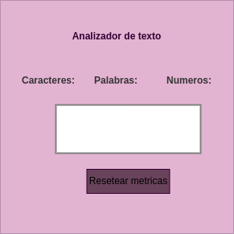

# Analizador de texto

## Índice

* [1. Introducción](#1-introducción-a-la-app)
* [2. Funcionalidad](#2-funcionalidad)
* [3. Diseño](#3-diseño)

***

## 1. Introducción a la app

La app text analyzer extrae información valiosa de un texto, en esta ocasión será ingresado por el usuario utilizando herramientas de desarrollo web como html, css y javascript. Los datos analizados proporcionan el conteo de caracteres, conteo de palabras, números o longitud del texto

---

## 2. Funcionalidad 

  * La aplicación permite que el usuario ingrese el texto deseado en un cuadro de texto.
  * La aplicación calcula las métricas contenidas en ella en tiempo real. Las métricas que contiene son:

    * **Recuento de palabras:** conteo de número de palabras en el texto ingresado y  mostrar este recuento al usuario.

    * **Recuento de caracteres:** conteo del número de caracteres en el texto de ingresado, incluidos espacios y signos de puntuación, y mostrar este recuento al usuario.

    * **Recuento de caracteres sin espacios y signos de puntuación:** conteo el número de caracteres en el texto ingresado, excluyendo espacios y signos de puntuación, y mostrar este recuento al usuario.

    * **Recuento de números:** conteo de números en el texto ingresado y mostrar este recuento al usuario.

    * **Suma total de números:**  suma de  todos los números en el texto ingresado y mostrar el resultado al usuario.

    * **Longitud media de las palabras:** cálculo de la longitud media de las palabras en el texto ingresado y mostrar el resultado al usuario.

  * La aplicación debe permitir limpiar el contenido de la caja de texto haciendo click en un botón.

---

## 3. Diseño

En esta oportunidad esta app está prototipada bajo el diseño de baja fidelidad, inspirado en el minimalismo y colores pasteles:

